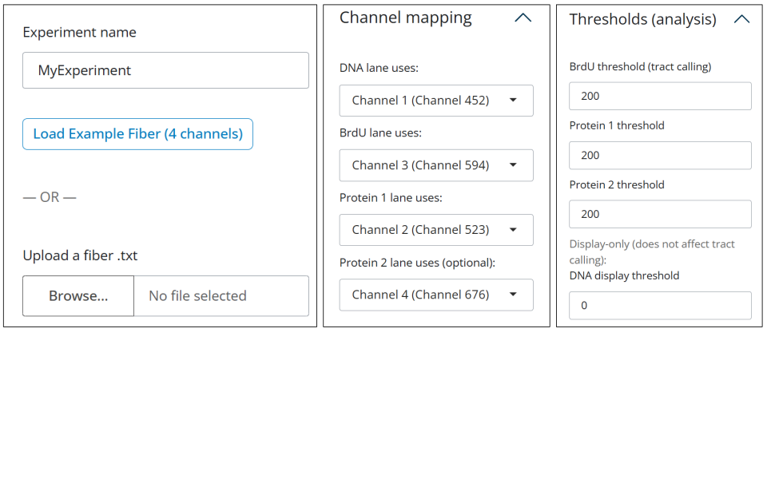
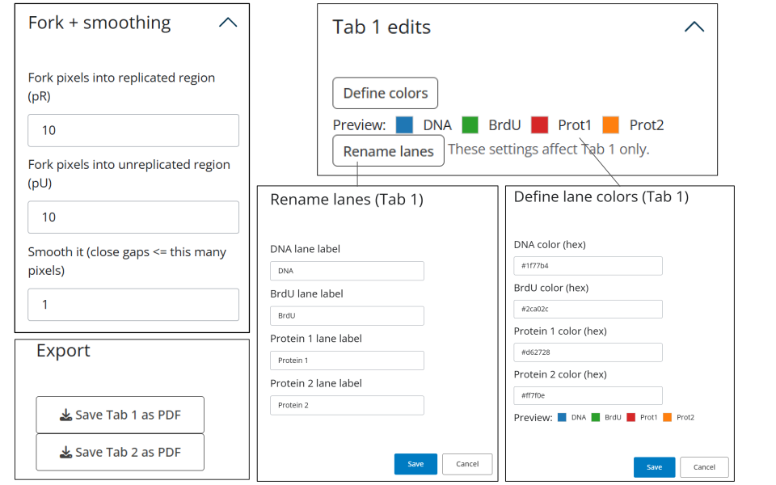
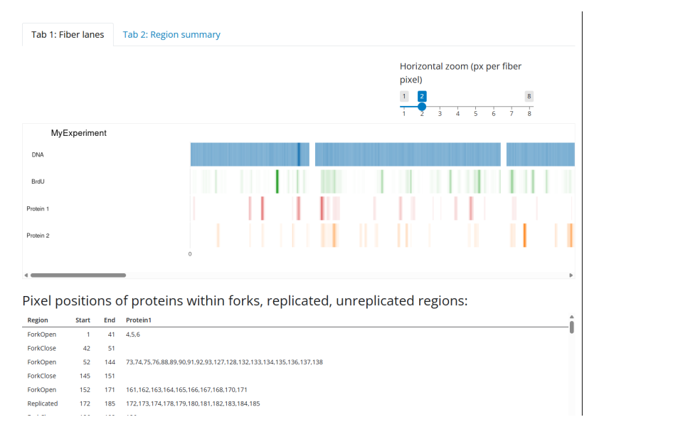
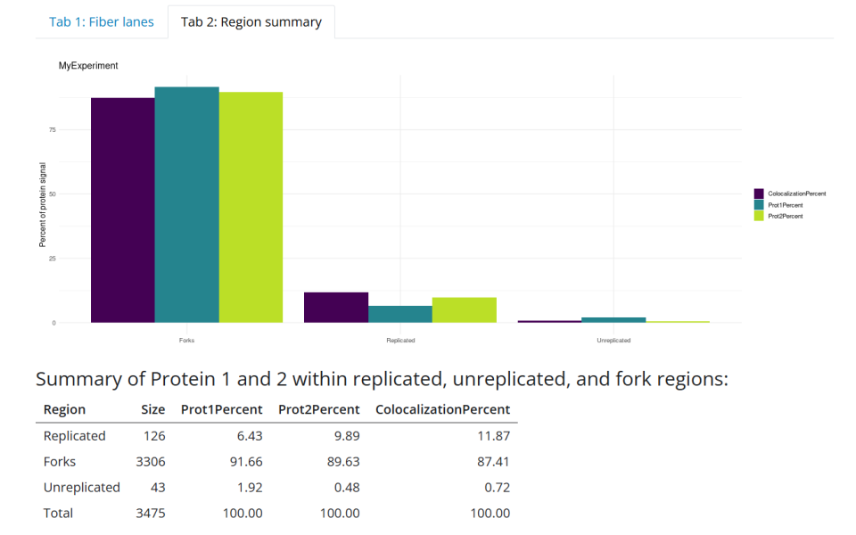

# R-ODD-BLOBS
### (One Dimensional Data – Boolean Logic Binning System)


ODD-BLOBS is a pipeline for modelling DNA replication structures using quantitative chromatin fiber data.
During DNA replication, the **replication fork** forms at the boundary between replicated and unreplicated DNA. While fork activity has traditionally been inferred using genetic, molecular and sequencing approaches, these methods do not directly visualize fork structure along individual chromatin fibers.

Thus, we developed ODD-BLOBS to analyze chromatin fiber intensity data to identify:

- replicated DNA regions  
- replication forks  
- unreplicated DNA  
- protein localization and co-localization along the fiber  

### Quick Link: 
> Purpose: enables modelling of replication structures/protein behaviour along individual DNA fibres
- Run the web application here: <https://kazeera.shinyapps.io/R-ODD-BLOBS/>. Or copy and paste the following into the search bar:
```
https://kazeera.shinyapps.io/R-ODD-BLOBS
```


---

# Credits

Conceptualized by:
**Dr. Sarah Sabatinos and Marc Green**

See: Sabatinos, S. A., & Green, M. D. (2018). *A Chromatin Fiber Analysis Pipeline to Model DNA Synthesis and Structures in Fission Yeast.* In **Genome Instability** (pp. 509-526)

Implemented in **R** by:
**Kazeera Aliar and Kerenza Cheng**

Preprint on biorxiv, see <https://www.biorxiv.org/content/10.1101/2024.11.01.621594v2>


# Visual Pipeline

</img>
</img>
---
# Methods of Running R-ODD-BLOBS

## Method 1: RShiny Visualization App (Recommended)

An interactive application is included in this repo to run ODD-BLOBS and visualize fiber data.

The interface allows users to do the following:

- upload fiber intensity tables  
- map imaging channels (DNA, BrdU, proteins)  
- adjust analysis thresholds  
- visualize fibers as stacked heatmaps  
- summarize protein distribution across replication regions  
- export figures as PDF  

### Running the Shiny app


Launch the web app: <https://kazeera.shinyapps.io/R-ODD-BLOBS/>. Or copy and paste the following into the search bar:
```
https://kazeera.shinyapps.io/R-ODD-BLOBS
```
And the interface opens in your browser.

---

### App Interface


## Left Panel - User Inputs

The left panel allows user to upload fiber data, define channel mappings and adjust analysis parameters used by ODD-BLOBS.





---

## Right Side - Visualization

#### Tab 1: Fiber Visualization

> Displays stacked intensity tracks for each channel:

* DNA control
* BrdU (replication signal)
* Protein 1
* Protein 2 (optional)

Features:

* zoomable fiber visualization
* customizable lane labels
* customizable lane colors
* channel mapping flexibility
* export figure as PDF



---

#### Tab 2: Region Summary

> Displays a bar plot summarizing protein localization across fibre regions:

* replicated DNA
* forks
* unreplicated DNA

Uses a color-blind friendly **viridis palette**.



</img>
---

### User Guide [todo]

Detailed instructions for using the Shiny app are available here:

**[ODD-BLOBS Shiny User Guide](USER_GUIDE_ODDBLOBS_SHINY.pdf)**

---

## Method 2: Running the R Scripts Directly

The original ODD-BLOBS analysis can also be run directly using the R scripts.

This approach produces JSON output files and may be useful for automated analysis pipelines.

---

# Files

### oddblobs_.R

Located in:

```
scripts/r/
```

Main script used to:

* read fiber data and user-defined parameters
* threshold intensity arrays
* identify replication tracts
* define fork boundaries
* detect protein localization

---

### functions_.R

Contains helper functions used to process and reformat data during the analysis pipeline.

---

# Input

## Fiber data table (.txt)

Input files contain fluorescence intensity arrays measured along chromatin fibers. Each channel represents an intensity along a single fiber.

Typical columns include:

```
Channel 1
Channel 2
Channel 3
Channel 4
X (pixel)
Y (pixel)
X (microns)
Y (microns)
```

Only the **Channel columns** are used by ODD-BLOBS.

---

## Command-line arguments

The original script requires eight parameters:

1. experiment name
2. file name
3. tract threshold
4. protein 1 threshold
5. protein 2 threshold
6. fork pixels into replicated region (pR)
7. fork pixels into unreplicated region (pU)
8. smoothing parameter (close gaps ≤ X pixels)

---

# Output

## table1.json

Contains sequential regions along the fiber trace.

Each object corresponds to a region:

* forkOpen
* replicated
* forkClose
* unreplicated

Example:

```
{
  "Region": "Replicated",
  "Start": 100,
  "End": 111,
  "Protein1": "[ ]",
  "Protein2": "[101,102,103,104,110,111]"
}
```

---

## table2.json

Summarizes protein distribution across region types.

Example:

```
{
  "Size": 466,
  "Prot1Percents": 44.44,
  "Prot2Percents": 46.82,
  "_row": "Tracts"
}
```

---

# Dependencies

R ≥ 3.4.4
Required R packages:

```
jsonlite
shiny
ggplot2
dplyr
tidyr
bslib
viridis
```
